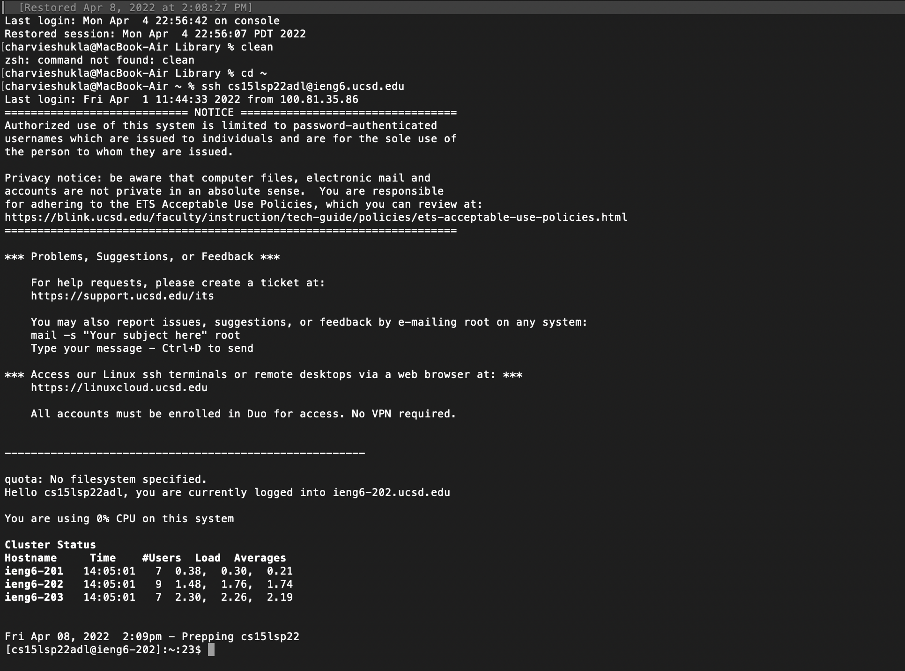

# CSE 15L Lab 2 
> Charvi Shukla 

>cshukla@ucsd.edu

## Installing Vscode
_This tutorial assumes that you have a java (13 or newer) already installed on your machine._

**Step 1:** Go on this link and click the Mac Download button 

**Step 2:** Open the file and keep following the instructions that the system prompts.

**Step 3:** Open VS code. 

**Step 4:** Open up command palette (Shift + Command  + P), or click view --> Command Palette from the top bar.

Step 5. Type "Install 'Code' command in PATH." Then hit enter. 
Step 6. Open terminal and type:

`$ code <filename>.java`

So, you can say for instance type:

`$ code HelloWorld.java`

**Step 7:** Open VS code, go on terminal. Atlernatively, you can also type in the terminal:

`$ code` 

**Step 8:** Click File > New File 

**Step 9:** Type the following code into your file and hit Command + S:

``class HelloWorld{
	public static void main(String[] args){
		System.out.println("Hello world!");
	}
} ``

Step 10: Open terminal and type 
`$ javac HelloWorld.java `

`$ java HelloWorld `

**Troubleshooting**

 If your mac not let you open the file since you downloaded it from the internet, you would need to allow the .dmg file to be able to open. To troubleshoot this problem, do the following:

1. Go on System Preferences. 
2. Click Security and Privacy. 
3. Click the little lock symbol at the bottom and enter your mac password. 
4. Allow downloads from "App store and identified developers"
5. Try opening the file 

## Remotely Connecting 
**Step 1:** Open Terminal 

**Step 2:** make sure you are in your home directory 

**Step 3:** Type out the following command in the terminal 
`$ <your account name>@ieng6.ucsd.edu `

**Step 4:** Enter your password (if you have one) 

**Step 5:** Hit enter. You should be able to see something like this:

You are now conneced remotely!

## Trying some commands

## Moving Files with SCP 

## Setting the `SSH` key 

