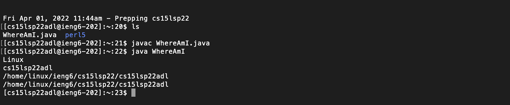

# CSE 15L Lab 1 
> Charvi Shukla 

>cshukla@ucsd.edu

## Introduction 

Hello there! Welcome to my Lab report 1 for CSE 15L. This page contains tutorials on:
* Installing VS code
* Remotely Connecting 
* Trying Some Commands
* Moving Files with scp
* Setting an SSH Key
* Optimizing Remote Running

## Installing Vscode
_This tutorial assumes that you have a java (13 or newer) already installed on your machine._

**Step 1:** Go on this [link](https://code.visualstudio.com/download) and click the Mac Download button 

**Step 2:** Open the file and keep following the instructions that the system prompts.

**Step 3:** Open VS code. 

**Step 4:** Open up command palette (Shift + Command  + P), or click view --> Command Palette from the top bar.

Step 5. Type "Install 'Code' command in PATH." Then hit enter. 
Step 6. Open terminal and type:

`$ code <filename>.java`

So, you can say for instance type:

`$ code HelloWorld.java`

**Step 7:** Open VS code, go on terminal. Atlernatively, you can also type in the terminal:

`$ code` 

**Step 8:** Click File > New File 

**Step 9:** Type the following code into your file and hit Command + S:

``class HelloWorld{
	public static void main(String[] args){
		System.out.println("Hello world!");
	}
} ``

Step 10: Open terminal and type 
`$ javac HelloWorld.java `

`$ java HelloWorld `

**Troubleshooting**

 If your mac not let you open the file since you downloaded it from the internet, you would need to allow the .dmg file to be able to open. To troubleshoot this problem, do the following:

1. Go on System Preferences. 
2. Click Security and Privacy. 
3. Click the little lock symbol at the bottom and enter your mac password. 
4. Allow downloads from "App store and identified developers"
5. Try opening the file 

## Remotely Connecting 
**Step 1:** Open Terminal 

**Step 2:** make sure you are in your home directory 

**Step 3:** Type out the following command in the terminal 
`$ <your account name>@ieng6.ucsd.edu `

**Step 4:** Enter your password (if you have one) 

**Step 5:** Hit enter. You should be able to see something like this:

You are now conneced remotely!

## Trying some commands
`cd`: change directory 

This command changes the directory from the one you are in to a different one so that you can execute other commands on a different directory and perform various functions such as viewing the contents of a different directory or opening a file in a different directory

`ls`: list files 

This command enables you to see all the files or directories contained in the directory you are currently in. 

`pwd`: print working directory 

This command gives you your current exact location on the computer

`mkdir`: make directory 

This command allows the user to create a directory (or in other words, a folder) in the directory you are currently in. 

`rm`: remove

Remove or rm is a prefix that you can use with other terms to delete a file or even a whole directory. This is an irreversible command.

`touch`: create a file

Touch can essentially allow you to make _any_ type of file, but it is initially empty. This blank file can then be opened in a tet editor. 

`man`: display command manual 

## Moving Files with SCP 

This part of the blog focuses on moving files online using `scp`. 
The scp command is always run on the client, i.e. it will always run from your computer. 

> **Step 1** 

On your computer, create any file that you want to move. For the sake of this tutorial, let's call it `WhereAmI.java`. 

We will be putting the following content in it:

``class WhereAmI {
  public static void main(String[] args) {
    System.out.println(System.getProperty("os.name"));
    System.out.println(System.getProperty("user.name"));
    System.out.println(System.getProperty("user.home"));
    System.out.println(System.getProperty("user.dir"));
  }
}``

> **Step 2** 

Using terminal **on your own machine** type:

`$ javac WhereAmI.java` (this would compile your code)

`$ java WhereAmI` (this would run your code)

> **Step 3** 

Then, from your cmputer, while remaining in the same directory from where you created and ran this file, type into the terminal:

`scp WhereAmI.java cs15lsp22<abc>@ieng6.ucsd.edu:~/`

_Note: "abc" is where you need to put your personal user ID number_

> **Step 4** 

Then the terminal would prompt you to enter your password.

> **Step 5** 

Log into `ssh` again, and use the command `ls` and you should be able to see `WhereAmI.java`. You sould be able to see something like this.

> **Step 6** 

Try and run you program again with `javac` and `java`. You are sunning that file on the `ieng` computer now!

## Setting the `SSH` key 
**Why use `ssh-keygen`?**

We use `SSH` keys so that we dont have to enter our password each time we log into the server. This can save you a lot of time. 

The program `ssh-keygen` creates a files on your machine called the __public key__ (found at a certian location on the server) and the __private key__ (found at a certian location on the client).

The private key is stored in a file called `id_rsa`.

The public key is stored in a file called `id_rsa.pub`).

Then the `ssh` would replace your password with these files! 

**How to set up `key-gen`**

**Step 1**
On your machine, go on terminal and enter: 

`$ ssh-keygen`

`Generating public/private rsa key pair.` (This is creating the files which will be saved in the 2 locations mentioned above)

**Step 2**
Enter file in which to save the key. Therefore, you would need to type in:

(/Users/"user-name"/.ssh/id_rsa): /Users/"user-name"/.ssh/id_rsa

**Note:** In the command shown above, you would need to put your own computer username in place of "user-name". 

On pressing enter, you should see:

`Enter passphrase (empty for no passphrase): `

Make sure you just hit enter AND DO NOT USE A PASS PHRASE. 

**Step 3**

Hit enter again when you see:

`Enter same passphrase again:`

**Step 4**

The terminal the tells you where your public and private keys are stored respectively:

`Your identification has been saved in /Users/"user-name"/.ssh/id_rsa.`

`Your public key has been saved in /Users/"user-name"/.ssh/id_rsa.pub.`

Ans it shows you your fingerprint!

`The key fingerprint is:
SHA256:jZaZH6fI8E2I1D35hnvGeBePQ4ELOf2Ge+G0XknoXp0 "user-name" @" system" .local`

**Step 5**
 You also see cool art!

**Step 6**

Everytime you log in to `ssh` you should no longer require a passcode! Here is what it should look like

**Step 8**

Let's try and see how much time this saves us!

* Open terminal 
* Type `ssh <your account name>@ieng6.ucsd.edu`
* Hit enter 

Your terminal screen should look similar. 

The point of using keygen was to save valuable developer time. You can now log into the remote server with less than 5 clicks! 

## Conclusion

With this, I conclude my Lab report 1. Thankyou for reading!!

