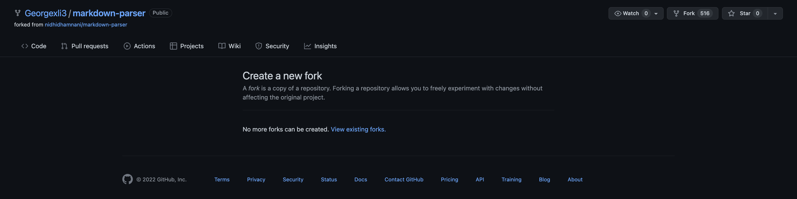

# CSE 15L Lab 2 

> __Name__ : Charvi Shukla 

> __Email__ : cshukla@ucsd.edu 

## Introduction

Hello! Welcome to my Lab report #2 for CSE 15L! For the purpose of this lab report, I will be utilizing the MarkdownParse experiment we did in the Lab section for weeks 3 and 4. Since the assignment involved paired programming, we made all the changes in my partner, George Li's, repository. However, when I try to fork this repository that we worked on, I see this on the screen:



Therefore, I created another repository called `markdown-parse-lab2`. Then, I cloned George's `markdown-parse` into this new repository I made on my account. All the links that I will be  inlcuding in this lab report will be from this **new** repository. 

## Screenshot for code change

Here is what our code change page looks like:


Click [here](https://github.com/charvishukla/markdown-parser-lab2/commit/2880d403612786f485cc0db46e56594b8c0de3d1) to see the page.

## Link to the test file for a _failure-inducing input_

This [testfile](https://github.com/charvishukla/markdown-parser-lab2/blob/main/empty_file.md) is an example of a failiure inducing input. This file, called `empty_file.md` does not have any contents, which causes errors while compiling the original version of `MarkdownParse.java`.

In order to fix this problem we added the following lines of code to the file:

```
if(markdown.length() == 0){
    return(null);
}
```

This change can be seen in lines 14, 15, and 16 in the code change screenshot above. 

## The symptom of that _failure-inducing input_

Here is what I see when I run `MarkdownParse.java` with the test file `fail1.md`:

---> insert image 

## The **bug**, the **symptom**, and the **failiure-inducing output**