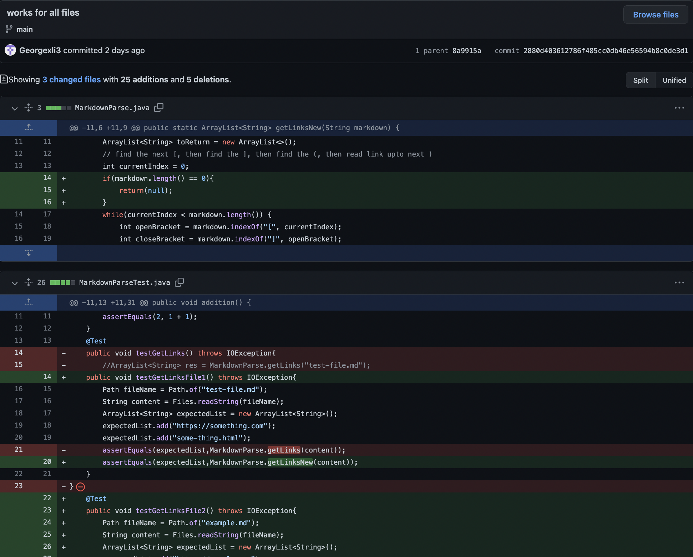
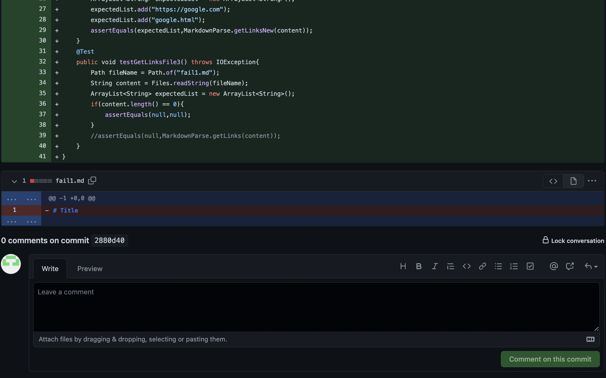
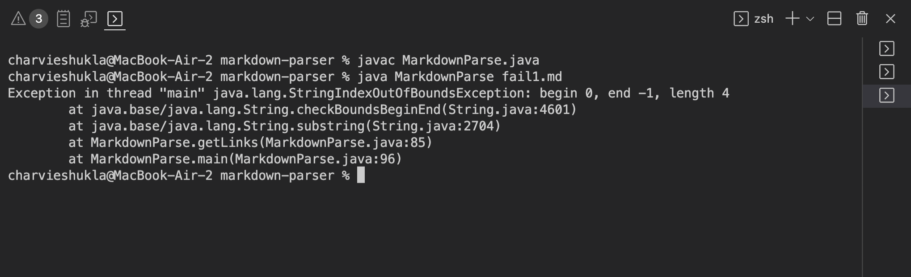
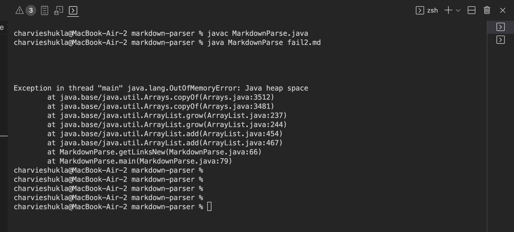
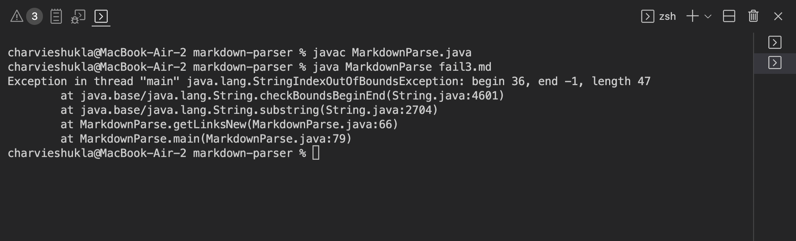
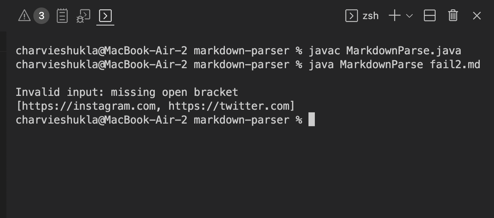
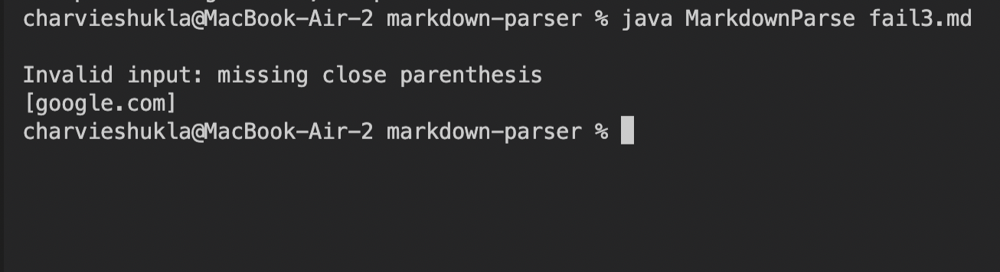

# CSE 15L Lab 2 

> __Name__ : Charvi Shukla 

> __Email__ : cshukla@ucsd.edu 

## Introduction

Hello! Welcome to my Lab report #2 for CSE 15L! For the purpose of this lab report, I will be utilizing the MarkdownParse experiment we did in the Lab section for weeks 3 and 4. I worked on the `markdown-parse` lab experiment with George during class time, and forked his repository.

## Screenshot for code change

Here is what our code change page looks like:

Click [here](https://github.com/charvishukla/markdown-parser/commit/2880d403612786f485cc0db46e56594b8c0de3d1) to see the page.

## Link to the test file for a _failure-inducing input

**Defining a failiure inducing input**

Let's first define what a failiure-inducing input actually is. A **failiure-inducing input** is an input to the program that allows buggy code to execute, leading to symptoms. Symptoms are essentially wrong outputs or situations where the code crashes. 

**Failiure inducing input 1**

This testfile, called [fail1.md](https://github.com/charvishukla/markdown-parser/blob/main/fail1.md) is an example of a failiure inducing input. The file, called `fail1.md` does not have any contents. This causes errors while running with the original version of `MarkdownParse.java`.

**Failiure inducing input 2**

This testfile, called [fail2.md](https://github.com/charvishukla/markdown-parser/blob/main/fail2.md) is an example of a failiure inducing input. It contains an extra paragraph in addition to the links, which causes errors when running with the original version of `MarkdownParse.java`.

**Failiure inducing input 3**

This testfile, called [fail3.md](https://github.com/charvishukla/markdown-parser/blob/main/fail3.md) is an example of a failiure inducing input. The last link in that md file does not end with a closing parenthesis. This is not accounted for in the original version of `MarkdownParse.java`, causing errors. 

## The symptom of that _failure-inducing input_

Let us first define what "symptom of a failiure-inducing input" actually means.

**Symptopm for failiure inducing input1**

The failure-inducing input here is the testfile called [fail1.md](https://github.com/charvishukla/markdown-parser/blob/main/fail1.md). It causes a `StringIndexOutOfBoundsException` which looks as following in the terminal:

A `StringIndexOutOfBoundsException` happens when the code tries to access either a negative or an index bigger than the length of the string. 

**Symptopm for failiure inducing input1**

The failiure inducing input here is [fail2.md](https://github.com/charvishukla/markdown-parser/blob/main/fail2.md). This causes a `java.lang.OutOfMemoryError: Java heap space` error. This happens because the extra paragraph occurs before the links and does not contain any brackets or parenthesis. The algorithm orginally does not contain any means to account for such a situation leading to the error.

Ususally a `java.lang.OutOfMemoryError: Java heap space` error-message is thrown when there is insufficient space to allocate an object in the Java heap.

**Symptopm for failiure inducing input1**

Thhe failiure inducing input here is [fail3.md](https://github.com/charvishukla/markdown-parser/blob/main/fail3.md). There is an `IndexOutOfBounds` exception because the input file does not have a closing parenthesis for one of the links. The error message looks like this:

This, again, is a `StringIndexOutOfBoundsException`. It happens when the code tries to access either a negative or an index bigger than the length of the string. 

## The **bug**, the **symptom**, and the **failiure-inducing input**

**Bug-input-symptom relationship for `fail1.md`**

The bug in this scenario is the missing code that account for empty files. When a _failiure-inducing input_, i.e. an empty ".md" file is used (fail1.md in this case), the symptom is seen. Here, the symptom is a `StringIndexOutOfBoundsException` being thrown. 

**Bug-input-symptom relationship for `fail2.md`**

The bug in this scenario is the missing code that account for inpputs that are not links, i.e. invalid inputs. When a _failiure-inducing input_, i.e. gibbersih in the input, which is not formatted as links is used, we run into an error. Here, the symptom is a `java.lang.OutOfMemoryError: Java heap space` exception being thrown. 

**Bug-input-symptom relationship for `fail3.md`**

The bug in this scenario is the missing code that account for missing parenthesis. This means that the code should contain if statements which account for When a _failiure-inducing input_, i.e. wrongly formatted links are used, the symptom is seen. Here, the symptom is a `StringIndexOutOfBoundsException` being thrown. 

## Correct Code Output 
Here is a screenshot of the code returning the correct output for all these inputs!

`fail1.md` correct output

`fail2.md` correct output 

`fail3.md` correct output

## Conclusion 
This conculdes my lab report #2. Thank you for reading! 

Sources Used: [How To Debug](https://blog.regehr.org/archives/199)

