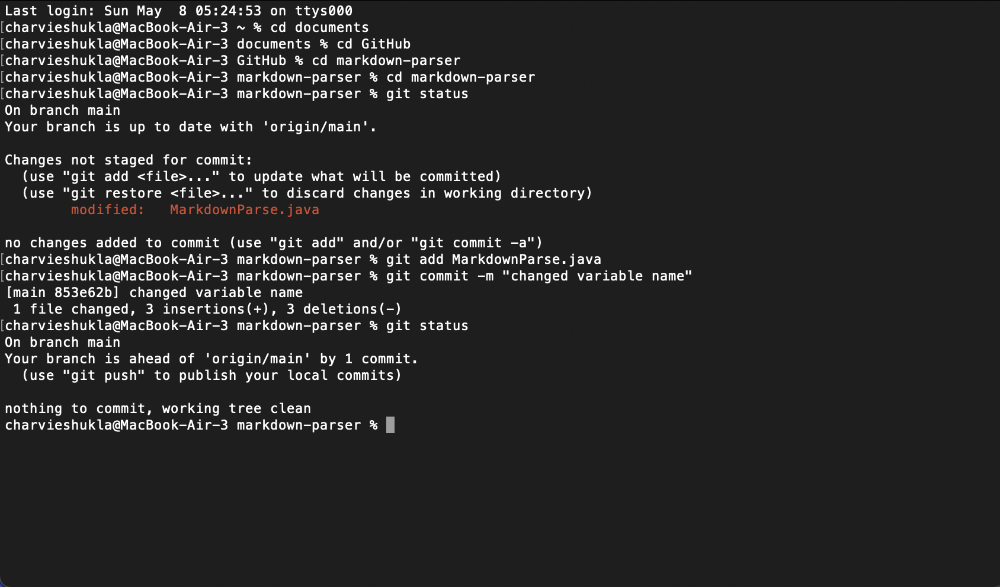

# CSE 15L Lab 3

> __Name__ : Charvi Shukla 

> __Email__ : cshukla@ucsd.edu 

## Introduction
Hello! Welcome to my Lab Report 3 - Week 6 for CSE 15L!
In this lab report I will be going over the following:
* Streamlining `ssh` configuration 
* Setting up Github Access from ieng6
* Copying whole directories with scp -r

## **Task 1: Streamlining `ssh` Configuration**

**Step 1**

For the first step, I created a folder called `ssh` and created a `config` file inside it. 
Then, in Visual Studio Code, I added the following lines into the `config` file:

```
Host ieng6
    HostName ieng6.ucsd.edu
    User cs15lsp22adl 
```
Here is a screenshot from VS Code:


**Step 2**

Now, when I go to terminal, I would only need to type in `ieng6` to log into ieng6 instead of the entire email address. This would help save a lot of time. 

Here is a screenshot from logging in:


**Step 3**

In addition, I would now be able to move around files using `scp` with just typing in `ieng6`. I created a random file called `fileToMove` and moved it to ieng6 for the demonstration. 

Here is what that looks like:


## **Task 2: Setup Github Access from ieng6**

**Step 1: Creating keys using keygen**

On the terminal, I typed `ssh-keygen` to create a set of private and public keys. They got stored in the `.ssh` directory. 


**Step 2: Copying over the Public Key**

Then, I copied the contents of `id_rsa_github` using the command `cat ~/.ssh/id_rsa_github.pub`. Then I went on setting on GitHub and added my private key:


On hitting the `Add SSH key` button, I was able to see this:


**Step 3: Managing Multiple keys**

I added the GitHub information to my `config` file as well, in order to save time. 


**Step 4: Using Git commands**

In the next step, I made small edits to `markdown-parser.java`. Then, via the terminal, I staged the changes with the following command:

`git add MarkdownParse.java`

Then, I added a commit message:

`git commit -m "adding a line"`

And, finally, I pushed the changes to GitHub:

`git push origin main`




Yay! The changes have now been pushed! click [here](https://github.com/charvishukla/markdown-parser/commit/853e62b8fb9e4820306a957c9fadda9e8c287606) to view the commit link. 

Here is also a screenshot of the commit page:


**Step 5: Repeating with `ieng6`**

I repeated the same steps while being logged into `ieng6`. That is, I created keys using `ssh-keygen` and stored them on `ieng6`. Then i copied over the public key to GitHub and added the SSH key. After doing this, I would be able to use git commands while being logged into `ieng6`.

Generating keys and copying the public key:


Pushing changes from `Skill-Dem` to GitHub (P.S.: This is not my actual Skill Demonstration, just a failed version)


## **Task 3: Copying whole directories with scp -r**

Instead of copying each file in a directory one by one, using `scp -r` enables the user to be able to copy the entire directory at a time. 

For this lab report, i will be copying over `markdown_parse_2` to `ieng6` using the following command. 

**Step 1: Copying files**

I used the following command to copy the directory over:

`$ scp -r . ieng6:~/markdown_parser_2`


**Step 2: Running the tester file**

In order to run the tests, I first compiled the test file using:

`javac -cp .:lib/junit-4.13.2.jar:lib/hamcrest-core-1.3.jar MarkdownParseTest.java`

And then, I ran the test file using:

`java -cp .:lib/junit-4.13.2.jar:lib/hamcrest-core-1.3.jar org.junit.runner.JUnitCore MarkdownParseTest`

All the tests passed, and the terminal looked like this:


**Step 3: combining scp, ;, and ssh to copy the whole directory and run the tests in one line**

Before starting on this part of the lab report, i deleted the existing `markdown_parser_2` version on `ieng6` using `rm -r markdown_parser_2`. 

To combine copying and running files into a single command i used the following command on the terminal:

`scp -r . ieng6:~/markdown_parser_2; javac -cp .:lib/junit-4.13.2.jar:lib/hamcrest-core-1.3.jar MarkdownParseTest.java; java -cp .:lib/junit-4.13.2.jar:lib/hamcrest-core-1.3.jar org.junit.runner.JUnitCore MarkdownParseTest`

Here are screenshots of the output:


## **Conclusion**
This concludes my Lab report 3. Thank you for reading!
