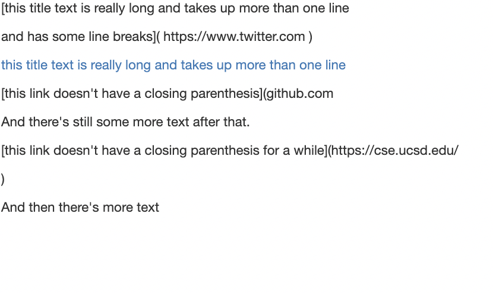
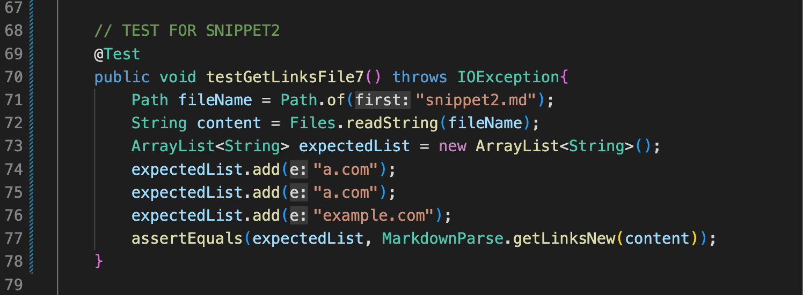

# CSE 15L Lab 4

> __Name__ : Charvi Shukla 

> __Email__ : cshukla@ucsd.edu 

## INTRODUCTION
For this lab report I will be running several extra tests on my version of `MarkdownParse.java` and the one we reviewed in Lab 7. 

For Lab 7, my group decided to use my version of `MarkdownParse.java` to the other group, and the link to that repository can be found [here](https://github.com/charvishukla/markdown_parser_2). 

The repository that we reviewed was from another group, and the link to that can be found [here](https://github.com/chw081/markdown-parser.git).

## EXPECTED OUTPUT

In order to find the expected output, I will be using the website, `commonmark.js dingus`. A link to this page can be found [here](https://spec.commonmark.org/dingus/).

1. **Code Snippet 1**

Snippet being used:

```
`[a link`](url.com)

[another link](`google.com)`

[`cod[e`](google.com)

[`code]`](ucsd.edu)

```
Expected output:


Therefore, since common mark sees "another link", [google.com] should be in the output. 


2. **Code Snippet 2**

Snippet being used:

```
[a [nested link](a.com)](b.com)

[a nested parenthesized url](a.com(()))

[some escaped \[ brackets \]](example.com)

```

Expected output:


Similarly, here, the output should include the links that commonmark recoginzes. These include [a.com, a.com, example.com]

3. **Code Snippet 3**

Snippet being used:

```
[this title text is really long and takes up more than 
one line

and has some line breaks](
    https://www.twitter.com
)

[this title text is really long and takes up more than 
one line](
https://sites.google.com/eng.ucsd.edu/cse-15l-spring-2022/schedule
)


[this link doesn't have a closing parenthesis](github.com

And there's still some more text after that.

[this link doesn't have a closing parenthesis for a while](https://cse.ucsd.edu/

```

Expected output:



Here, the expected output should include the follwing link: [https://sites.google.com/eng.ucsd.edu/cse-15l-spring-2022/schedule]

## ADDING TESTS TO MY REPOSITORY 

Now that I have figured out what the expected values would be, I can go ahead and write tests in my version of markdown parse:

I created 3 new .md files: `snippet1.md`, `snippet2.md`, and `snippet3.md` in my MarkdownParser repository. 

I then wrote the following tests:

Test 1 screenshot:


Test 2 screenshot:



Test 3 screenshot: 


Running the tests:
To run these tests, I used the following commands on terminal:

Compiling: `javac -cp .:lib/junit-4.13.2.jar:lib/hamcrest-core-1.3.jar MarkdownParseTest.java`


Running: `java -cp .:lib/junit-4.13.2.jar:lib/hamcrest-core-1.3.jar org.junit.runner.JUnitCore MarkdownParseTest`

Running Screenshot:


## ADDING TESTS TO THE REVIEWED REPOSITORY 

Cloning the repository:

Test 1 screenshot:

Test 2 screenshot:

Test 3 screenshot: 
