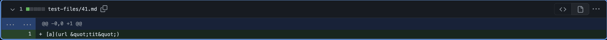
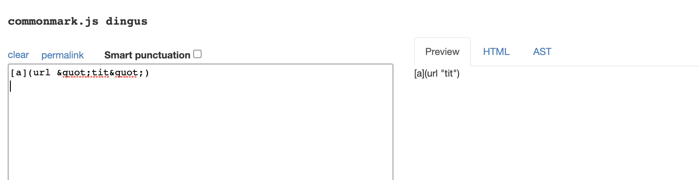

# CSE 15L Lab 4

> __Name__ : Charvi Shukla 

> __Email__ : cshukla@ucsd.edu 

## INTRODUCTION
Welcome to my lab report 5 for CSE 15L!

## TASK 1

**I. Finding the differing results**

To find the different results, I did the following steps:

1. Step 1: Copied the directory containing all the test files over, from the given repository, to my own repository. To do that, I used the following command:

`cp -r cse15lsp22-markdown-parser/test-files markdown_parser_2/`

2. Step 2: Copied the `script.sh` file using the command: 

`cp cse15lsp22-markdown-parser/script.sh markdown_parser_2/`

3. Step 3: Then, I copied over all the results of running those test files into `results.txt`. To do that, I used the command:

`bash script.sh > results.txt`

4. Step 4: Repeat the same thing for the cloned repository. [Given repository](https://github.com/nidhidhamnani/markdown-parser)

5. Step 5: Used `vimdiff` to compare the differences. I used the following command to do so:

`vimdiff markdown_parser_2/results.txt cse15lsp22-markdown-parser/results.txt`

**The results on the right are the results from runnning the tests with the given repository, while the ones on the right are the ones that were ran on my version on markdown parser**

## TASK 2 
**DIFFERING TEST FILES I CHOSE**

> `test-files/41.md`

Contents:

Test result: 

[Commit Link for 41](https://github.com/nidhidhamnani/markdown-parser/blob/main/test-files/41.md)

> `test-files/495.md`

Contents

Test result:

[Commit Link for 495](https://github.com/nidhidhamnani/markdown-parser/blob/main/test-files/495.md)

## TASK 3 

**Figuring out the correct expected output**

To get the correct expected output for parsing the contents of these given files, I will be using the [common mark website](https://spec.commonmark.org/dingus/)

Expected output for `41.md`

Expected output for `495.md`

**Test file 41**

From analysing this we can see that the result for `41.md` should simply be `[]` since common mark does not recognize any of the inputs as Links.

We can see that the given code produces the correct output, i.e. it results in empty brackets. On the other hand, simply returns a message indicating to the user that the input is incorrect. 

**Test file 495**

From analysing the output result in common mark, we can see that the expected output should be the embedded "link" `foo(and(bar))`
The output from the given repository does produce the correct output.

However, my output has 2 problems: (1) it prints out an error message for no reason. (2) it misses a parenthesis in the second line of the output. 

Instead of printing `foo(and(bar))`, my output prints `foo(and(bar)`

**For the implementation that’s not correct (or choose one if both are incorrect), describe the bug (the problem in the code) in about 2-3 sentences. You don’t have to provide a fix, but you should be specific about what is wrong with the program, and show the code that should be fixed (Provide a screenshot of code and highlight where the change needs to be made).**
