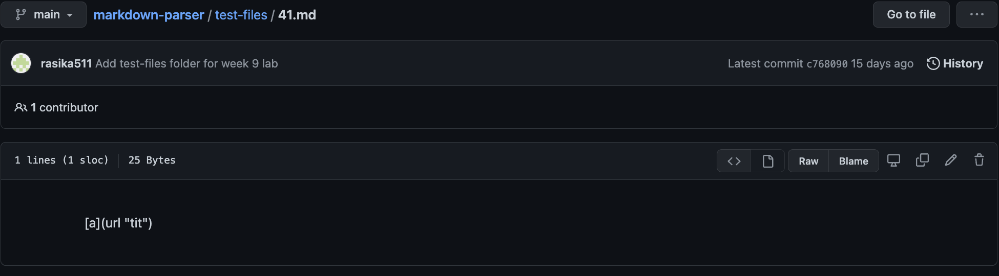
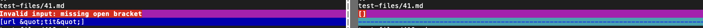
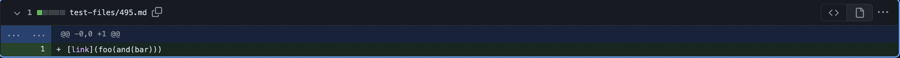
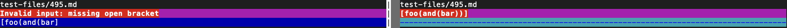
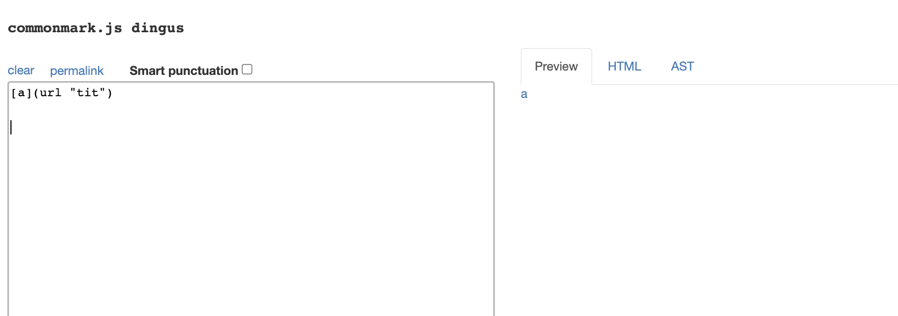
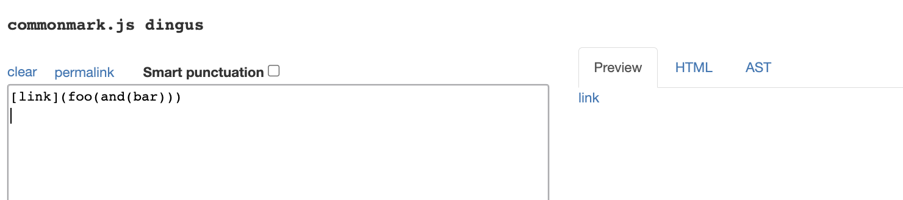
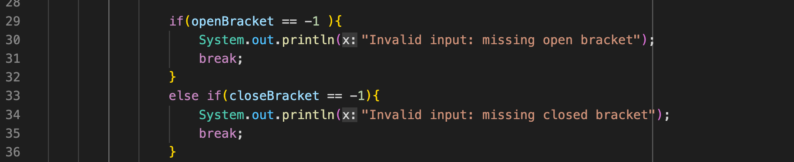
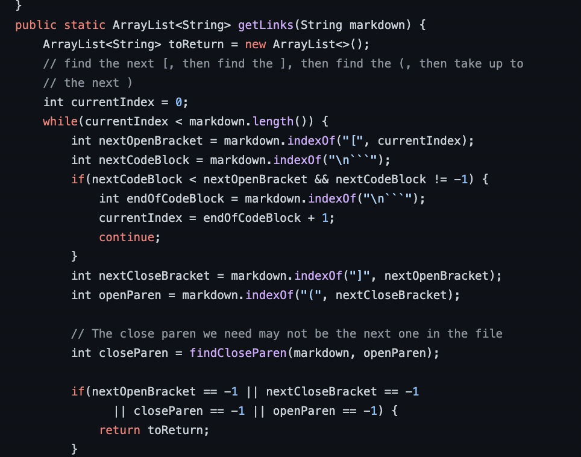

# CSE 15L Lab 4

> __Name__ : Charvi Shukla 

> __Email__ : cshukla@ucsd.edu 

## INTRODUCTION
Welcome to my lab report 5 for CSE 15L!

## TASK 1

**I. Finding the differing results**

To find the different results, I did the following steps:

1. Step 1: Copied the directory containing all the test files over, from the given repository, to my own repository. To do that, I used the following command:

`cp -r cse15lsp22-markdown-parser/test-files markdown_parser_2/`

2. Step 2: Copied the `script.sh` file using the command: 

`cp cse15lsp22-markdown-parser/script.sh markdown_parser_2/`

3. Step 3: Then, I copied over all the results of running those test files into `results.txt`. To do that, I used the command:

`bash script.sh > results.txt`

4. Step 4: Repeat the same thing for the cloned repository. [Given repository](https://github.com/nidhidhamnani/markdown-parser)

5. Step 5: Used `vimdiff` to compare the differences. I used the following command to do so:

`vimdiff markdown_parser_2/results.txt cse15lsp22-markdown-parser/results.txt`

**The results on the right are the results from runnning the tests with the given repository, while the ones on the right are the ones that were ran on my version on markdown parser**

## TASK 2 
**DIFFERING TEST FILES I CHOSE**

> `test-files/41.md`

Contents:

Test result: 

[Commit Link for 41](https://github.com/nidhidhamnani/markdown-parser/blob/main/test-files/41.md)

> `test-files/495.md`

Contents

Test result:

[Commit Link for 495](https://github.com/nidhidhamnani/markdown-parser/blob/main/test-files/495.md)

## TASK 3 

**Figuring out the correct expected output**

To get the correct expected output for parsing the contents of these given files, I will be using the [common mark website](https://spec.commonmark.org/dingus/)

Expected output for `41.md`

Expected output for `495.md`

**Test file 41**

From analysing both the outputs we can see that both the implementations produce the wrong ouutput for this test case. Both implementations do not recognize the link. My implementation throws an error message saying that there is a missing bracket. 

On the other hand, the given implementation does not read any substring and just returns `[]`

**Test file 495**

From analysing the output result in common mark, we can see that the expected output should be the embedded "link" `foo(and(bar))`
The output from the given repository does produce the correct output.

However, my output has 2 problems: (1) it prints out an error message for no reason. (2) it misses a parenthesis in the second line of the output. 

Instead of printing `foo(and(bar))`, my output prints `foo(and(bar)`

## POETENTIAL CHANGES 

**Test file 41**

_Change in my imlementation_

Since the input contains `" "` additional if statements could be added to my implementation to allow for additional symbols that might cause this problem. These include, but are not limited to, `" @ # $ % *` and so on. Since quotes come in pairs, a feild for `openQuote` and `closedQuote` can be made and a substring between that could be read.

_Change in the given imlementation_

we can see that since there is additional  text, `url`, we would want to ignore that and just read what is inside the quotations. This means that we would want to use the index of the quotes for reading the substring insead of using the parentheses. 

To achieve this, we can add a feild for `openQuote`. If the index of `openQuote` is greater than the index of  `openParen` then we can just update `openParen` to be `openQuote`. The same thing, but vice versa, can be done for `closeParen` and `closeQuote` this would ensure that link `a` is read correctly. These changes can be implemented at the beginnning of the while loop shown above.

**Test file 495**

The current expected input contains a set of nested parentheses. To fix this, another feild called `openParenthesisCounter` and `closeParenthesisCounter`could be added to line 19 and 20. This can then be used to keep track of all the possible parentheses in a link, and ensure that the current markdown parser reads the substrings between approprate indices.

In addition, a condition can be added to all of these if statements so that the statement does not execute immediately if there are multiple parentheses and accounts for the entire string before going in the if statement. 

## CONCLUSION

This concludes my 5th lab report! Thank you for reading! :) 